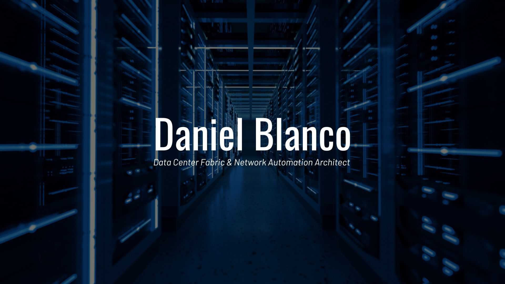

  

  📍 Madrid, Spain &nbsp;&bull;&nbsp; 💼 Senior Infrastructure Security Architect

  Senior Network & Infrastructure Security Architect with over 20 years of experience designing, deploying, and automating enterprise-scale infrastructures. Focused on scaling Security Fabric frameworks, Infrastructure as Code (IaC) pipelines, NetDevOps workflows, and transforming traditional networking operations into agile, code-driven environments.

---

  
  

    

      📂 ARCHITECTURE BLUEPRINT & NAVIGATION HUB
    

    

      <a href="#connect" style="text-decoration: none;">
        
          ⚡ Quick Contact
        
      </a>
    

  

  <table width="100%" style="border-collapse: collapse; border: none; background: none; margin: 0;">
    <tr style="border: none; background: none;">
      <td width="49%" style="vertical-align: top; border: none; padding: 0 8px 0 0;">
        <a href="#carrier--telco-architecture-footprint" style="text-decoration: none; display: block; margin-bottom: 10px;">
          

            🌐 &nbsp; Carrier & Telco Footprint
          

        </a>
        <a href="#technical-focus--core-expertise" style="text-decoration: none; display: block; margin-bottom: 10px;">
          

            🛡️ &nbsp; Technical Focus & Core Expertise
          

        </a>
        <a href="#extended-cloud-transit--advanced-systems" style="text-decoration: none; display: block; margin-bottom: 10px;">
          

            ☁️ &nbsp; Extended Cloud Transit Systems
          

        </a>
        <a href="#automation-stack--programmability" style="text-decoration: none; display: block; margin-bottom: 10px;">
          

            🤖 &nbsp; Automation Stack & Code
          

        </a>
        <a href="#professional-experience" style="text-decoration: none; display: block; margin-bottom: 10px;">
          

            💼 &nbsp; Professional Timeline
          

        </a>
      </td>
      <td width="2%" style="border: none; background: none;"></td>
      <td width="49%" style="vertical-align: top; border: none; padding: 0 0 0 8px;">
        <a href="#core-architecture-patterns" style="text-decoration: none; display: block; margin-bottom: 10px;">
          

            🏛️ &nbsp; Core Architecture Patterns
          

        </a>
        <a href="#ecosystem-interoperability--presales-edge" style="text-decoration: none; display: block; margin-bottom: 10px;">
          

            🔀 &nbsp; Ecosystem & Presales Edge
          

        </a>
        <a href="#open-source-labs--production-simulation" style="text-decoration: none; display: block; margin-bottom: 10px;">
          

            🔬 &nbsp; Open-Source Simulation Labs
          

        </a>
        <a href="#technical-certifications--specialized-courses" style="text-decoration: none; display: block; margin-bottom: 10px;">
          

            📜 &nbsp; Certifications & Frameworks
          

        </a>
        <a href="#selected-projects" style="text-decoration: none; display: block; margin-bottom: 10px;">
          

            🚀 &nbsp; Selected Enterprise Projects
          

        </a>
      </td>
    </tr>
  </table>

---

## Carrier & Telco Architecture Footprint

  A significant portion of my professional career has been deeply focused on <strong>High-Scale Telecommunications and Core Provider Environments</strong>. I have spent years architecting, scaling, and operating mission-critical network infrastructures within major global carriers and wholesale operators:

  <h3 style="margin-top: 0; margin-bottom: 8px; color: #ff7b72; font-size: 1.1em;">
     
    Core Fabric & Infrastructure Homologation
  </h3>
  

    Years of hands-on engineering dedicated to the structural homologation of next-generation SDN architectures. Led the integration of complex multi-tenant data center environments, active core migrations for highly available routing layers, and production edge security deployment frameworks.
  

  <h3 style="margin-top: 0; margin-bottom: 8px; color: #79c0ff; font-size: 1.1em;">
     
    Service Provider Routing & Edge Operations
  </h3>
  

    Deep alignment with carrier-grade transport environments, engineering large-scale routing platforms, multi-protocol core transport infrastructures, and sophisticated edge perimeter security solutions designed to support mass-volume business critical telemetry.
  

  <h3 style="margin-top: 0; margin-bottom: 8px; color: #56d364; font-size: 1.1em;">
     
    Wholesale Carrier Networks & Backbone Systems
  </h3>
  

    Design and operational deployment optimization inside specialized wholesale telecommunications backbones. Streamlining transit routing nodes, structural interconnection profiles, and security infrastructure matrices built for resilient data-plane delivery at national scale.
  

---

## Technical Focus & Core Expertise
<table width="100%" style="border-collapse: collapse; border: none; background: none;">
  <tr style="border: none; background: none;">
    <td width="32%" style="vertical-align: top; border: none; padding: 18px; background-color: #161b22; border-radius: 8px; border: 1px solid #30363d;">
      <h4 style="color: #58a6ff; margin-top: 0; margin-bottom: 12px; font-size: 1.05em; border-bottom: 1px solid #30363d; padding-bottom: 6px;">Data Center & SDN Fabrics</h4>
      

         <strong>Cisco ACI / Nexus:</strong> Multi-Pod/Multi-Site fabrics, APIC clustering & L3Out enrutamiento. 
         <strong>Arista EVPN-VXLAN:</strong> Leaf-Spine overlay topologies & Anycast Gateways. 
         <strong>Arista CVP:</strong> Automated configlets, change control & state telemetry. 
         <strong>Cisco IPFM:</strong> High-performance broadcast IP video/audio matrix architectures. 
         <strong>Juniper Apstra:</strong> Intent-Based Networking (IBN) for autonomous DC data operations.
      

    </td>
    <td width="2%" style="border: none; background: none;"></td>
    <td width="32%" style="vertical-align: top; border: none; padding: 18px; background-color: #161b22; border-radius: 8px; border: 1px solid #30363d;">
      <h4 style="color: #58a6ff; margin-top: 0; margin-bottom: 12px; font-size: 1.05em; border-bottom: 1px solid #30363d; padding-bottom: 6px;">Fortinet Enterprise Security</h4>
      

         <strong>FortiGate Infrastructure:</strong> High-Availability clustering, multi-tenant VDOMs & hardware SSL inspection. 
         <strong>FortiSwitch & FortiAP:</strong> Secure access layers under unified FortiLink software management. 
         <strong>Palo Alto Networks:</strong> Zero Trust architecture orchestration & Panorama service policies. 
         <strong>Zscaler SSE:</strong> Cloud-delivered perimeter protection via ZPA & ZIA secure edge gateways.
      

    </td>
    <td width="2%" style="border: none; background: none;"></td>
    <td width="32%" style="vertical-align: top; border: none; padding: 18px; background-color: #161b22; border-radius: 8px; border: 1px solid #30363d;">
      <h4 style="color: #58a6ff; margin-top: 0; margin-bottom: 12px; font-size: 1.05em; border-bottom: 1px solid #30363d; padding-bottom: 6px;">NetDevOps & Automation</h4>
      

         <strong>Python Programmability:</strong> Scripting interfaces, custom API processing & extraction modules. 
         <strong>Ansible Networks:</strong> Infrastructure as Code playbook tracking & Jinja2 configuration maps. 
         <strong>Source of Truth:</strong> Dynamic NetBox inventory hooks for live automated provisioning. 
         <strong>FortiManager API:</strong> Global multi-ADOM policy deployment workflows & template provisioning. 
         <strong>Declarative IaC:</strong> Multi-cloud edge networks, transit VPCs & cloud secure insertion profiles.
      

    </td>
  </tr>
</table>

---

## Extended Cloud Transit & Advanced Systems
<table width="100%" style="border-collapse: collapse; border: none; background: none;">
  <tr style="border: none; background: none;">
    <td width="32%" style="vertical-align: top; border: none; padding: 18px; background-color: #161b22; border-radius: 8px; border: 1px solid #30363d;">
      <h4 style="color: #58a6ff; margin-top: 0; margin-bottom: 12px; font-size: 1.05em; border-bottom: 1px solid #30363d; padding-bottom: 6px;">Hybrid & Cloud Networking</h4>
      

         <strong>AWS Transit Infrastructure:</strong> Enterprise account Transit Gateways & redundant Direct Connect pipelines. 
         <strong>Azure Cloud Routing:</strong> Virtual WAN routing architectures, hub-spoke secure segmentation & ExpressRoute overlays. 
         <strong>GCP Interconnect:</strong> Cloud Routers, Shared VPC architectures & cross-environment dynamic BGP paths.
      

    </td>
    <td width="2%" style="border: none; background: none;"></td>
    <td width="32%" style="vertical-align: top; border: none; padding: 18px; background-color: #161b22; border-radius: 8px; border: 1px solid #30363d;">
      <h4 style="color: #58a6ff; margin-top: 0; margin-bottom: 12px; font-size: 1.05em; border-bottom: 1px solid #30363d; padding-bottom: 6px;">DevOps & Observability</h4>
      

         <strong>CI/CD Integration:</strong> Automated GitLab CI/CD & GitHub Actions environments for design validation. 
         <strong>Telemetry Extraction:</strong> Prometheus collectors & responsive Grafana operational tracking environments. 
         <strong>Log Architecture:</strong> Splunk Core log parsing, advanced dashboard design & proactive infrastructure metrics.
      

    </td>
    <td width="2%" style="border: none; background: none;"></td>
    <td width="32%" style="vertical-align: top; border: none; padding: 18px; background-color: #161b22; border-radius: 8px; border: 1px solid #30363d;">
      <h4 style="color: #58a6ff; margin-top: 0; margin-bottom: 12px; font-size: 1.05em; border-bottom: 1px solid #30363d; padding-bottom: 6px;">Fortinet Security Fabric Extended</h4>
      

         <strong>FortiAnalyzer & FortiSIEM:</strong> Enterprise log management, data aggregation & cross-vendor event correlation. 
         <strong>Access Engineering:</strong> FortiAuthenticator directory interfaces, FortiToken MFA maps & FortiEDR endpoints.
      

    </td>
  </tr>
</table>

---

## Automation Stack & Programmability
<table width="100%" style="border-collapse: collapse; border: none; background: none;">
  <tr style="border: none; background: none;">
    <td width="49%" style="vertical-align: top; border: none; padding: 18px; background-color: #161b22; border-radius: 8px; border: 1px solid #30363d;">
      <h4 style="color:#58a6ff; margin-top: 0; margin-bottom: 12px; font-size: 1.05em; border-bottom: 1px solid #30363d; padding-bottom: 6px;">Network APIs & Modeling</h4>
      

         <strong>Data Models:</strong> YANG structured validation, JSON schemas & YAML design blueprints. 
         <strong>Protocols:</strong> NETCONF, RESTCONF and high-frequency gNMI/gRPC telemetry streaming layers. 
         <strong>Fortinet API Automation:</strong> Automated resource tracking via FortiOS REST API for dynamic address-object and custom application definitions.
      

    </td>
    <td width="2%" style="border: none; background: none;"></td>
    <td width="49%" style="vertical-align: top; border: none; padding: 18px; background-color: #161b22; border-radius: 8px; border: 1px solid #30363d;">
      <h4 style="color:#58a6ff; margin-top: 0; margin-bottom: 12px; font-size: 1.05em; border-bottom: 1px solid #30363d; padding-bottom: 6px;">Testing Architecture & Validation</h4>
      

         <strong>Validation Frameworks:</strong> Batfish control-plane routing simulation & SuzieQ network state analytics. 
         <strong>Container Infrastructure:</strong> Multi-vendor isolated routing images for execution testing environments. 
         <strong>Artifact Engineering:</strong> Modular Jinja2 code rendering, dynamic inventories & config mapping sheets.
      

    </td>
  </tr>
</table>

---

## 💼 Professional Timeline

  

    

      <h3 style="margin: 0; color: #58a6ff; font-size: 1.2em; font-weight: 600;">Platform Engineer</h3>
      
Lunik

    

    

      
        Dec 2024 – Present
      
    

  

  
  

    
    
    
    
    
    
    
    
  

  
  

    My work in this period has been heavily focused on automation, standardisation, and platform management as code: reducing manual setup, moving configuration into versioned systems, and making internal tooling easier to operate and easier for other teams to consume.
  

  

    

      <h3 style="margin: 0; color: #58a6ff; font-size: 1.2em; font-weight: 600;">DevOps and Cloud Engineer</h3>
      
Plain Concepts

    

    

      
        Feb 2024 – Dec 2024
      
    

  

  
  

    
    
    
    
    
    
    
    
  

  
  

    At Plain Concepts, I worked with multiple teams to improve their GitHub usage and delivery workflows, helping them get more value out of the platform and its ecosystem.
  

  

    

      <h3 style="margin: 0; color: #58a6ff; font-size: 1.2em; font-weight: 600;">Site Reliability Engineer</h3>
      
NomuPay

    

    

      
        Jan 2022 – Feb 2024
      
    

  

  
  

    
    
    
    
    
    
    
    
  

  
  

    At NomuPay, I helped build the platform foundations from zero in a small team, combining platform engineering, production operations, incident response, and observability.
  

---

## Core Architecture Patterns

- **Advanced Fortinet NGFW Security & Edge Cluster Engineering:** Architecture and implementation of enterprise security perimeters running on **FortiGate NGFW appliances** in active-active/active-passive high availability (**FGCP/FGSP clustering**). Advanced deployment of policy segmentation via virtual domains (**VDOMs**), hardware-accelerated **SSL/TLS Deep Packet Inspection** at scale, and centralized contextual access controls utilizing **FortiNAC** for automated asset discovery and dynamic network access isolation.
- **Secure Access Layer Integration:** Design and provisioning of secure enterprise switching access topologies. Implementation of automated deployment workflows for **FortiSwitch arrays and FortiAP access nodes via hardware-enforced FortiLink control planes** to consolidate management within the central firewall core.
- **Centralized Security Operations & Data Analysis (FortiManager / FortiAnalyzer):** Architecture design of multi-tenant governance models using ADOMs in **FortiManager** to orchestrate thousands of corporate security policy packages. Aggregation and normalization of telemetry logs using **FortiAnalyzer** clusters to automate compliance reporting and incident detection playbooks.
- **Carrier-Grade Security Frameworks (Gi/SGi & CGNAT):** Clear engineering domain over service provider environments, focusing on securing Gi/SGi LAN interfaces, multi-tenant CGNAT scale-out protection maps on high-end FortiGate chassis, and implementing low-latency stateful inspection for massive mobile and fixed-line data planes.
- **NFV & Telco Cloud Integration:** Deployment of virtualized security functions (VNF) using FortiGate-VM series across OpenStack, VMware vCloud NFV, and carrier-grade container environments to achieve elastic, on-demand security perimeter scaling.
- **Cisco Enterprise Data Center Fabrics:** Structural design of high-density **Cisco ACI Multi-Pod & Multi-Site** environments. Orchestration of APIC controllers, design of multi-tenant segmentation policies (VRFs, Bridge Domains, EPGs), and secure external perimeter routing utilizing optimized **L3Out infrastructure profiles**. High-capacity deployments across **Cisco Nexus series switches** utilizing advanced vPC, Fibre Channel over Ethernet (FCoE), and out-of-band management topologies.
- **Arista Production EVPN-VXLAN Clos Networks:** High-performance, low-latency leaf-spine modern datacenter fabrics running under **Arista EOS**. Structural engineering of Layer 3 control planes using Multi-Protocol BGP (MP-BGP), hardware-based VXLAN encapsulation, and standardized **Distributed Anycast Gateways** to reduce cross-fabric traffic. Fully orchestrated using **Arista CloudVision Portal (CVP)** for state telemetry, zero-touch provisioning (ZTP), and automated configlets enforcement.
- **Cloud Transit Architectures:** Cloud Native Hub-and-Spoke connectivity networks, Managed Transit Gateways, Cross-Cloud Network Security Ingress/Egress Insertion.

---

## Ecosystem Interoperability & Presales Edge

- **Multi-Vendor Core Integration:** Seamless fabric interoperability experience connecting Fortinet security environments with **Cisco (IOS-XR/Nexus)** backbones, **F5 BIG-IP** high-availability local/global load balancers, and legacy **Check Point/Palo Alto** architectures during migration phases.
- **Technical Consulting & Whiteboarding:** Strong background translating high-level business requirements and complex RFPs into solid, low-level technical reference architectures. Experienced in defending designs in front of Tier-1 operators' engineering steering committees.

---

## Open-Source Labs & Production Simulation

-  <strong>Containerized Emulation Frameworks:</strong> Rapid prototyping and deployment of lightweight, multi-vendor network fabrics using **Containerlab** coupled with optimized **Docker** sandboxes.
-  <strong>Hypervisor-Based Lab Topologies:</strong> Design, testing, and full orchestration of complex multi-vendor network nodes inside advanced **EVE-NG** and **GNS3** environments.
-  <strong>Virtualized Edge Routing:</strong> Orchestration of isolated routing nodes using **VyOS** to reliably mimic physical service provider and enterprise core edge topologies.

---

## Technical Certifications & Specialized Courses
<table width="100%" style="border-collapse: collapse; border: none;">
  <tr style="border: none; background: none;">
    <td width="50%" style="vertical-align: top; border: none; padding-right: 25px; padding-top: 0;">
      

         <strong>Fortinet Network Security / Expert Track:</strong> Advanced Enterprise Firewall Infrastructure, Cloud Security Architecture, and Centralized Management (FortiGate/FortiManager/FortiAnalyzer) (Training). 
         <strong>Arista Cloud Engineer:</strong> Level 5 (ACE L5) & Level 3 (ACE L3). 
         <strong>Cisco CCIE Framework:</strong> Routing & Switching + Advanced ACI Architecture.
      

    </td>
    <td width="50%" style="vertical-align: top; border: none; padding-left: 25px; padding-top: 0;">
      

         <strong>Palo Alto Networks:</strong> Core Traffic Security & Threat Prevention Policies (Panorama Integration).
      

    </td>
  </tr>
</table>

---

## 📩 Connect With Me

  
  

