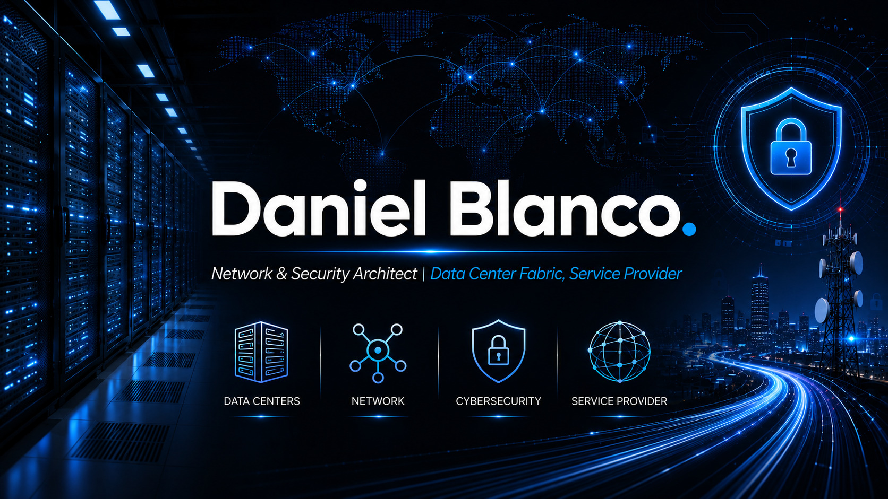

  

  📍 Madrid, Spain &nbsp;&bull;&nbsp; 💼 Senior Infrastructure Security Architect

  Senior Network & Infrastructure Security Architect with over 20 years of experience designing, deploying, and automating enterprise-scale infrastructures. Focused on scaling Security Fabric frameworks, Infrastructure as Code (IaC) pipelines, NetDevOps workflows, and transforming traditional networking operations into agile, code-driven environments.

### 🧭 QUICK INDEX NAVIGATION

| 🌐 **CORE PROFILE & STACK** | 🚀 **ARCHITECTURE & PROJECTS** |
| :--- | :--- |
|  |  |
|  |  |
|  |  |
|  |  |
|  |  |
|  |  |

---

## 🌐 Carrier & Telco Architecture Footprint

> **Architecting High-Availability, Scalable & Low-Latency Service Provider Infrastructure**

---

### 🏛️ Core Service Provider Capabilities

<table>
  <tr>
    <td width="50%" valign="top">
      <h4>📡 Backbone & Edge Routing</h4>
      <ul>
        <li><b>Segment Routing (SR-MPLS / SRv6)</b> & MP-BGP Core Transit</li>
        <li><b>L2VPN / L3VPN</b> Service Provider Fabrics & Multi-Site EVPN</li>
        <li><b>Peering & IXP Optimization</b> (BGP Traffic Engineering & FlowSpec)</li>
        <li><b>Carrier-Grade NAT (CGNAT)</b> & IPv4/IPv6 Dual-Stack Coexistence</li>
      </ul>
    </td>
    <td width="50%" valign="top">
      <h4>⚡ Transport, Cloud & Optical Edge</h4>
      <ul>
        <li><b>Optical Transport (DWDM/OTN)</b> & Data Center Interconnect (DCI)</li>
        <li><b>Telco Cloud & NFV Infrastructure</b> (OpenStack, Kubernetes CNI/Cilium)</li>
        <li><b>5G Core / MEC Connectivity</b> & Network Slicing Architectures</li>
        <li><b>High-Availability WAN</b> Resilience (BFD, Fast Reroute - FRR)</li>
      </ul>
    </td>
  </tr>
</table>

---

### 🛠️ Key Telecom Technologies & Protocols

  
  
  
  
  
  

---

### 🎯 Key Architectural Milestones
* **Multi-Service Core Migration:** HLD/LLD design and deployment of high-capacity IP/MPLS backbones for Tier-1 operators and global enterprise environments.
* **Carrier Edge Security:** Deployment of BGP FlowSpec architectures and DDoS mitigation mechanisms across Points of Presence (PoPs).
* **Automated Provisioning:** Lifecycle automation for BGP peering and L2/L3 service delivery leveraging **Python**, **Ansible**, and **IaC** pipelines.

---
## Technical Focus & Core Expertise
<table width="100%" style="border-collapse: collapse; border: none; background: none;">
  <tr style="border: none; background: none;">
    <td width="32%" style="vertical-align: top; border: none; padding: 18px; background-color: #161b22; border-radius: 8px; border: 1px solid #30363d;">
      <h4 style="color: #58a6ff; margin-top: 0; margin-bottom: 12px; font-size: 1.05em; border-bottom: 1px solid #30363d; padding-bottom: 6px;">Data Center & SDN Fabrics</h4>
      

         <strong>Cisco ACI / Nexus:</strong> Multi-Pod/Multi-Site fabrics, APIC clustering & L3Out enrutamiento. 
         <strong>Arista EVPN-VXLAN:</strong> Leaf-Spine overlay topologies & Anycast Gateways. 
         <strong>Arista CVP:</strong> Automated configlets, change control & state telemetry. 
         <strong>Cisco IPFM:</strong> High-performance broadcast IP video/audio matrix architectures. 
         <strong>Juniper Apstra:</strong> Intent-Based Networking (IBN) for autonomous DC data operations.
      

    </td>
    <td width="2%" style="border: none; background: none;"></td>
    <td width="32%" style="vertical-align: top; border: none; padding: 18px; background-color: #161b22; border-radius: 8px; border: 1px solid #30363d;">
      <h4 style="color: #58a6ff; margin-top: 0; margin-bottom: 12px; font-size: 1.05em; border-bottom: 1px solid #30363d; padding-bottom: 6px;">Fortinet Security</h4>
      

         <strong>FortiGate Infrastructure:</strong> High-Availability clustering, multi-tenant VDOMs & hardware SSL inspection. 
         <strong>FortiSwitch & FortiAP:</strong> Secure access layers under unified FortiLink software management. 
         <strong>Palo Alto Networks:</strong> Zero Trust architecture orchestration & Panorama service policies. 
         <strong>Zscaler SSE:</strong> Cloud-delivered perimeter protection via ZPA & ZIA secure edge gateways.
      

    </td>
    <td width="2%" style="border: none; background: none;"></td>
    <td width="32%" style="vertical-align: top; border: none; padding: 18px; background-color: #161b22; border-radius: 8px; border: 1px solid #30363d;">
      <h4 style="color: #58a6ff; margin-top: 0; margin-bottom: 12px; font-size: 1.05em; border-bottom: 1px solid #30363d; padding-bottom: 6px;">NetDevOps & Automation</h4>
      

         <strong>Python Programmability:</strong> Scripting interfaces, custom API processing & extraction modules. 
         <strong>Ansible Networks:</strong> Infrastructure as Code playbook tracking & Jinja2 configuration maps. 
         <strong>Source of Truth:</strong> Dynamic NetBox inventory hooks for live automated provisioning. 
         <strong>FortiManager API:</strong> Global multi-ADOM policy deployment workflows & template provisioning. 
         <strong>Declarative IaC:</strong> Multi-cloud edge networks, transit VPCs & cloud secure insertion profiles.
      

    </td>
  </tr>
</table>

## Extended Cloud Transit & Advanced Systems
<table width="100%" style="border-collapse: collapse; border: none; background: none;">
  <tr style="border: none; background: none;">
    <td width="32%" style="vertical-align: top; border: none; padding: 18px; background-color: #161b22; border-radius: 8px; border: 1px solid #30363d;">
      <h4 style="color: #58a6ff; margin-top: 0; margin-bottom: 12px; font-size: 1.05em; border-bottom: 1px solid #30363d; padding-bottom: 6px;">Hybrid & Cloud Networking</h4>
      

         <strong>AWS Transit Infrastructure:</strong> Enterprise account Transit Gateways & redundant Direct Connect pipelines. 
         <strong>Azure Cloud Routing:</strong> Virtual WAN routing architectures, hub-spoke secure segmentation & ExpressRoute overlays. 
         <strong>GCP Interconnect:</strong> Cloud Routers, Shared VPC architectures & cross-environment dynamic BGP paths.
      

    </td>
    <td width="2%" style="border: none; background: none;"></td>
    <td width="32%" style="vertical-align: top; border: none; padding: 18px; background-color: #161b22; border-radius: 8px; border: 1px solid #30363d;">
      <h4 style="color: #58a6ff; margin-top: 0; margin-bottom: 12px; font-size: 1.05em; border-bottom: 1px solid #30363d; padding-bottom: 6px;">DevOps & Observability</h4>
      

         <strong>CI/CD Integration:</strong> Automated GitLab CI/CD & GitHub Actions environments for design validation. 
         <strong>Telemetry Extraction:</strong> Prometheus collectors & responsive Grafana operational tracking environments. 
         <strong>Log Architecture:</strong> Splunk Core log parsing, advanced dashboard design & proactive infrastructure metrics.
      

    </td>
    <td width="2%" style="border: none; background: none;"></td>
    <td width="32%" style="vertical-align: top; border: none; padding: 18px; background-color: #161b22; border-radius: 8px; border: 1px solid #30363d;">
      <h4 style="color: #58a6ff; margin-top: 0; margin-bottom: 12px; font-size: 1.05em; border-bottom: 1px solid #30363d; padding-bottom: 6px;">Fortinet Security Fabric Extended</h4>
      

         <strong>FortiAnalyzer & FortiSIEM:</strong> Enterprise log management, data aggregation & cross-vendor event correlation. 
         <strong>Access Engineering:</strong> FortiAuthenticator directory interfaces, FortiToken MFA maps & FortiEDR endpoints.
      

    </td>
  </tr>
</table>

## Automation Stack & Programmability
<table width="100%" style="border-collapse: collapse; border: none; background: none;">
  <tr style="border: none; background: none;">
    <td width="49%" style="vertical-align: top; border: none; padding: 18px; background-color: #161b22; border-radius: 8px; border: 1px solid #30363d;">
      <h4 style="color:#58a6ff; margin-top: 0; margin-bottom: 12px; font-size: 1.05em; border-bottom: 1px solid #30363d; padding-bottom: 6px;">Network APIs & Modeling</h4>
      

         <strong>Data Models:</strong> YANG structured validation, JSON schemas & YAML design blueprints. 
         <strong>Protocols:</strong> NETCONF, RESTCONF and high-frequency gNMI/gRPC telemetry streaming layers. 
         <strong>Fortinet API Automation:</strong> Automated resource tracking via FortiOS REST API for dynamic address-object and custom application definitions.
      

    </td>
    <td width="2%" style="border: none; background: none;"></td>
    <td width="49%" style="vertical-align: top; border: none; padding: 18px; background-color: #161b22; border-radius: 8px; border: 1px solid #30363d;">
      <h4 style="color:#58a6ff; margin-top: 0; margin-bottom: 12px; font-size: 1.05em; border-bottom: 1px solid #30363d; padding-bottom: 6px;">Testing Architecture & Validation</h4>
      

         <strong>Validation Frameworks:</strong> Batfish control-plane routing simulation & SuzieQ network state analytics. 
         <strong>Container Infrastructure:</strong> Multi-vendor isolated routing images for execution testing environments. 
         <strong>Artifact Engineering:</strong> Modular Jinja2 code rendering, dynamic inventories & config mapping sheets.
      

    </td>
  </tr>
</table>

Aquí tienes una versión altamente visual y profesional del apartado de Experiencia Laboral en formato Markdown para tu perfil de GitHub.

Incluye la fecha actualizada para Lunik (hasta Junio de 2026), etiquetas (badges) para las tecnologías clave empleadas en cada puesto, y un diseño estilo línea de tiempo que destaca tus mayores logros y liderazgo técnico.

Markdown
## 💼 Professional Experience & Leadership

---

### 🚀 **Network Design Manager / Network Team Lead**
**[LUNIK](https://www.linkedin.com/)** | *Madrid, Spain*  

* **Leadership & Team Direction**: Directed high-performance engineering teams delivering mission-critical enterprise networks, cyber-security architectures, and virtualized infrastructure solutions.
* **Strategic SME & Vendor Engagement**: Served as primary Subject Matter Expert (SME) and architectural lead for strategic partnerships with **Cisco** and **Palo Alto Networks**.
* **Data Center & Cloud Architecture**: Spearheaded HLD/LLD for next-gen Data Center fabrics, Core Networks, and Public Cloud network integrations (**AWS** & **Azure**).
* **Zero Trust & SD-WAN**: Engineered a modern EVPN-VXLAN Data Center fabric coupled with Palo Alto Networks SD-WAN and Zero Trust Architecture (ZTA).
* **Panorama Migration**: Executed brownfield migration of enterprise firewall fleets to a centralized Panorama management platform without production downtime.

> **Tech Stack & Keywords:** >      

---

### 🏢 **Digital Infrastructure Team Leader / Professional Services Engineer**
**[NTT DATA](https://www.linkedin.com/)** *(formerly Dimension Data)* | *Madrid, Spain*  

* **Team Management & Delivery**: Managed Professional Services delivery across corporate data networks, security, and virtualization ecosystems for global Tier-1 accounts.
* **Multi-Vendor Ecosystems**: Coordinated large-scale architectural deployments integrating **Arista**, **Cisco**, **Palo Alto**, **Fortinet**, **Check Point**, **F5**, **VMware**, and **Aruba**.
* **Automation & IaC Acceleration**: Spearheaded automation initiatives using **Ansible** and **Python**, optimizing zero-touch provisioning and deployment cycles.
* **Infrastructure Design**: Designed complex Data Center fabrics and Cloud architectures for high-demand sectors (Global Banking, Telecom, and Public Administration).

> **Tech Stack & Keywords:** >     

---

<b>📜 Early Career History (1998 - 2008)</b>

 

* **DITELMA** | *Technical Services Engineer (2006 – 2008)* — *Deployed and managed corporate voice and data networking infrastructures.*
* **CAROSE** | *Technical Services Engineer (2004 – 2006)* — *Implementation and administration of corporate voice/data systems.*
* **LIDERNET** | *Technical Services Engineer (2003 – 2004)* — *Enterprise routing, switching, and multi-site client deployments.*
* **HC 2000 / MASTER COELECTRONIC / IKEA** | *Technical Services Specialist (1998 – 2003)* — *Advanced systems deployment, server solutions, and enterprise IT support.*

## 🏛️ Core Architecture Patterns

<table width="100%">
  <tr>
    <td width="33%" valign="top">
      <h3>🛡️ Security Perimeters & Operations</h3>
      <ul>
        <li>
           
          <b>NGFW Edge Clustering:</b> Active-active/passive High Availability, VDOM policy segmentation & SSL/TLS Deep Packet Inspection.
        </li>
         
        <li>
           
          <b>Access Layer Integration:</b> Hardware-enforced FortiLink control planes for FortiSwitch arrays & FortiAP nodes.
        </li>
         
        <li>
           
          <b>Centralized SecOps:</b> Multi-tenant ADOMs policy packages, log aggregation & compliance automation playbooks.
        </li>
      </ul>
    </td>
    <td width="33%" valign="top">
      <h3>🏛️ Data Center Fabrics & SDN</h3>
      <ul>
        <li>
           
          <b>Enterprise DC Fabrics:</b> Multi-Pod/Multi-Site APIC orchestration, VRF/BD segmentation & L3Out routing profiles.
        </li>
         
        <li>
           
          <b>Clos Leaf-Spine Networks:</b> MP-BGP control planes, VXLAN encapsulation & Distributed Anycast Gateways via CVP.
        </li>
         
        <li>
           
          <b>High-Density DC Core:</b> Advanced vPC, Fibre Channel over Ethernet (FCoE) & out-of-band management topologies.
        </li>
      </ul>
    </td>
    <td width="33%" valign="top">
      <h3>☁️ Telco Cloud & Transit Systems</h3>
      <ul>
        <li>
           
          <b>Carrier-Grade Protection:</b> Gi/SGi LAN interfaces, scale-out CGNAT protection maps & low-latency inspection.
        </li>
         
        <li>
           
          <b>NFV VNF Integration:</b> Virtualized security functions (FortiGate-VM) on OpenStack & vCloud NFV.
        </li>
         
        <li>
           
          <b>Multi-Cloud Connectivity:</b> Managed Transit Gateways & cross-cloud security ingress/egress insertion.
        </li>
      </ul>
    </td>
  </tr>
</table>

  
<strong>🔀 Click to view: Ecosystem Interoperability & Presales Edge</strong>

  

    <ul>
      <li style="margin-bottom: 10px;"><strong>Multi-Vendor Core Integration:</strong> Seamless fabric interoperability experience connecting Fortinet security environments with <strong>Cisco (IOS-XR/Nexus)</strong> backbones, <strong>F5 BIG-IP</strong> high-availability local/global load balancers, and legacy <strong>Check Point/Palo Alto</strong> architectures during migration phases.</li>
      <li style="margin-bottom: 10px;"><strong>Technical Consulting & Whiteboarding:</strong> Strong background translating high-level business requirements and complex RFPs into solid, low-level technical reference architectures. Experienced in defending designs in front of Tier-1 operators' engineering steering committees.</li>
    </ul>
  

## Open-Source Labs & Production Simulation

-  <strong>Containerized Emulation Frameworks:</strong> Rapid prototyping and deployment of lightweight, multi-vendor network fabrics using **Containerlab** coupled with optimized **Docker** sandboxes.
-  <strong>Hypervisor-Based Lab Topologies:</strong> Design, testing, and full orchestration of complex multi-vendor network nodes inside advanced **EVE-NG** and **GNS3** environments.
-  <strong>Virtualized Edge Routing:</strong> Orchestration of isolated routing nodes using **VyOS** to reliably mimic physical service provider and enterprise core edge topologies.

Aquí tienes el código Markdown completo en la Opción B (estilo Badges / Escudos dinámicos de desarrollo) con todas y cada una de tus certificaciones equipadas con su correspondiente distintivo visual:

Markdown
## 📜 Certifications & Technical Training

🤖 <b>AI, Cloud & Automation</b>

*  **Microsoft**: AI Applications & Agents on Azure
*  **Microsoft**: Develop AI Agents on Azure
*  **Microsoft**: AI Concepts for Developers
*  **Microsoft**: AZ-700 Azure Network Solutions
*  **AWS**: Advanced Networking Specialty
*  **AWS**: Route 53 (Basics & Getting Started) & Security Fundamentals
*  **OpenAI**: Course - Agents and Workflows
*  **LangChain**: Foundation - Introduction to LangChain-Python
*  **LangChain**: Quickstart - LangChain Essentials (Python)
*  **Isovalent**: Kubernetes Networking & Cilium
*  **Isovalent**: Discovery - Cloud Architect on Azure
*  **NVIDIA**: AI for All - From Basics to GenAI Practice
*  **Hugging Face**: The LLM Course - Fundamentals of LLMs
*  **IBM**: AI Fundamentals - Foundations for Understanding AI
*  **Cisco**: AI Business Practitioner
*  **Cisco**: AI for Networking
*  **Cisco**: AppDynamics Application Performance Analytics
*  **VMware**: VCA-DCV (Data Center Virtualization) & NSX Infrastructure Deployment

🛡️ <b>Network Security, SASE & Zero Trust</b>

*  **Palo Alto Networks**: Advanced SD-WAN Features & Micro-segmentation Design Architecture
*  **Fortinet**: NSE 1, NSE 2 & NSE 3 Certified in Cybersecurity
*  **Fortinet**: FortiGate Security Infrastructure (FCNSA)
*  **Cato Networks**: SASE Expert (Level 1 & 2)
*  **Cato Networks**: SASE Business Impact and Strategy
*  **Cato Networks**: SASE Deployment and Management
*  **Cato Networks**: AI in Cybersecurity
*  **Netskope**: SASE Accreditation
*  **Cisco**: Designing Cisco Security Infrastructure (SDSI)
*  **AttackIQ**: Threat-Informed Architecture
*  **AttackIQ**: Foundations of AI Security
*  **Microsoft**: Investigate and Respond to Microsoft Purview Data Loss Prevention Alerts
*  **Extreme Networks**: Certified Associate in ExtremeCloud SD-WAN
*  **Check Point**: CCSA GAIA R77.30 Deployment
*  **IBM**: Cybersecurity Fundamentals
*  **F5 BIG-IP**: Local Traffic Manager (LTM) Setup & Core Traffic Profiles

🌐 <b>Core Infrastructure & Routing/Switching</b>

*  **Arista Networks**: Cloud Engineer Level 5 (ACE L5) & Level 3 (ACE L3)
*  **Arista Networks**: Advanced Infrastructure Troubleshooting & Diagnostics
*  **Arista Networks**: Technical Specialist Advocate & Cognitive Campus
*  **Cisco**: CCIE - Routing & Switching Written (350-001)
*  **Cisco**: Implementing Cisco Application Centric Infrastructure (ACI Advanced)
*  **Cisco**: Operating Cisco IP Fabric for Media Solution
*  **Cisco**: CCNP Fast Track (Routing, Switching & Security ASA)
*  **NVIDIA**: InfiniBand Essentials (RDMA) & RoCE from A to Z
*  **NVIDIA**: SONIC Essentials, NetQ Deployment & NVIDIA DSX Air
*  **Juniper Networks**: JNCIS-ENT (Routing & Switching) & JNCIA Core
*  **Extreme Networks**: Certified Associate in Extreme Fabric Connect
*  **Extreme Networks**: Certified Associate - Building Scalable and Mission Critical Networks
*  **Alcatel-Lucent**: ACSE & ACFE Routing & Switching AOS 7.0 / OmniSwitch
*  **Aruba**: Deploying Datacenter Microsegmentation with Aruba CX 10000
*  **Aruba**: ACMA Aruba Wireless Certification

💼 <b>Leadership & Executive Communication</b>

*  **Executive Communication**: Speaking Confidently and Effectively Frameworks
*  **High-Performance Leadership**: Coaching Employees through Difficult Situations

## 🚀 Selected Projects

<table width="100%" style="border-collapse: collapse; border: none; background: none; margin-top: 15px;">
  <tr style="border: none; background: none;">
    <td width="49%" style="vertical-align: top; background-color: #161b22; border: 1px solid #30363d; border-radius: 8px; padding: 18px;">
      <h4 style="margin-top: 0; color: #58a6ff; font-size: 1em; margin-bottom: 10px;">
         Edge Security Migration
      </h4>
      
<strong>Vodafone & Telecable:</strong> Greenfield/brownfield migration from legacy Checkpoint to advanced Fortinet NGFW platforms. Optimized traffic via VDOMs and secured access layers using FortiSwitch/FortiLink.

    </td>
    <td width="2%" style="border: none; background: none;"></td>
    <td width="49%" style="vertical-align: top; background-color: #161b22; border: 1px solid #30363d; border-radius: 8px; padding: 18px;">
      <h4 style="margin-top: 0; color: #58a6ff; font-size: 1em; margin-bottom: 10px;">
         Policy Provisioning Engine
      </h4>
      
Programmatic IaC deployment pipeline utilizing Ansible playbooks and FortiOS REST API to standardize Next-Gen Firewall rules across FortiManager, reducing lead object synchronization cycles.

    </td>
  </tr>
  <tr style="height: 15px; border: none; background: none;"><td colspan="3" style="border: none; background: none;"></td></tr>
  <tr style="border: none; background: none;">
    <td width="49%" style="vertical-align: top; background-color: #161b22; border: 1px solid #30363d; border-radius: 8px; padding: 18px;">
      <h4 style="margin-top: 0; color: #58a6ff; font-size: 1em; margin-bottom: 10px;">
         Global Fabric Integration
      </h4>
      
Configured multi-tenant structural isolation layers (VDOMs) and accelerated high-throughput SSL decryption layers across international cloud entry-nodes to secure high-volume distributed traffic.

    </td>
    <td width="2%" style="border: none; background: none;"></td>
    <td width="49%" style="vertical-align: top; background-color: #161b22; border: 1px solid #30363d; border-radius: 8px; padding: 18px;">
      <h4 style="margin-top: 0; color: #58a6ff; font-size: 1em; margin-bottom: 10px;">
         ACI Fabric Homologation
      </h4>
      
<strong>Vodafone & Carrefour:</strong> Structural homologation, platform validation, and production migrations of Cisco ACI SDN Fabrics. Designed Multi-Pod topologies and isolated APIC ecosystems.

    </td>
  </tr>
  <tr style="height: 15px; border: none; background: none;"><td colspan="3" style="border: none; background: none;"></td></tr>
  <tr style="border: none; background: none;">
    <td width="49%" style="vertical-align: top; background-color: #161b22; border: 1px solid #30363d; border-radius: 8px; padding: 18px;">
      <h4 style="margin-top: 0; color: #58a6ff; font-size: 1em; margin-bottom: 10px;">
         EVPN-VXLAN Infrastructure
      </h4>
      
<strong>Tecnalia & Lunik:</strong> Bare-metal deployment of Arista EOS switches. Architected high-density leaf-spine virtual overlays with CloudVision for full data plane orchestration.

    </td>
    <td width="2%" style="border: none; background: none;"></td>
    <td width="49%" style="vertical-align: top; background-color: #161b22; border: 1px solid #30363d; border-radius: 8px; padding: 18px;">
      <h4 style="margin-top: 0; color: #58a6ff; font-size: 1em; margin-bottom: 10px;">
         Multi-Vendor Validation Lab
      </h4>
      
<strong>Banc Sabadell:</strong> Built an automated container lab using Ansible to test and validate network profiles across F5 BIG-IP, Checkpoint firewalls, Cisco ACI fabrics, Azure, and AWS cloud environments.

    </td>
  </tr>
  <tr style="height: 15px; border: none; background: none;"><td colspan="3" style="border: none; background: none;"></td></tr>
  <tr style="border: none; background: none;">
    <td width="49%" style="vertical-align: top; background-color: #161b22; border: 1px solid #30363d; border-radius: 8px; padding: 18px;">
      <h4 style="margin-top: 0; color: #58a6ff; font-size: 1em; margin-bottom: 10px;">
         Zero Trust Architecture
      </h4>
      
<strong>Lunik:</strong> Guided strategic design of corporate perimeters using Palo Alto Networks Next-Gen Firewalls to introduce strict macro/micro-segmentation security profiles.

    </td>
    <td width="2%" style="border: none; background: none;"></td>
    <td width="49%" style="vertical-align: top; background-color: #161b22; border: 1px solid #30363d; border-radius: 8px; padding: 18px;">
      <h4 style="margin-top: 0; color: #58a6ff; font-size: 1em; margin-bottom: 10px;">
         Virtualized Secure Insertion
      </h4>
      
<strong>AEAT & NTT:</strong> Managed core deployment of VMware NSX ecosystems, enforcing complex firewall service insertion maps alongside on-prem Kubernetes cluster instances.

    </td>
  </tr>
</table>

## 🧠 Methodologies & Philosophy

  
  
  
  
  
  

## 🗣️ Languages

- **English:** Professional Working Proficiency (Technical architecture design, multi-vendor client negotiation, global infrastructure documentation).
- **Spanish:** Native or Bilingual Proficiency.

## 📩 Get in Touch

  <a href="https://linktr.ee/daniel.blanco.work" target="_blank" style="text-decoration: none;">
    
      💬 Contact Me
    
  </a>

